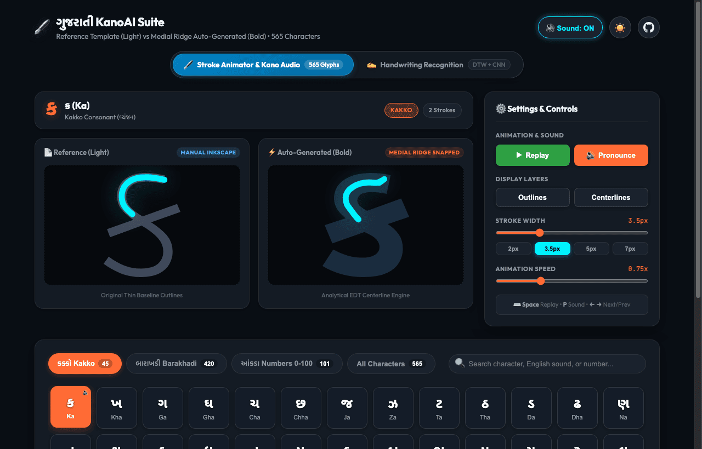
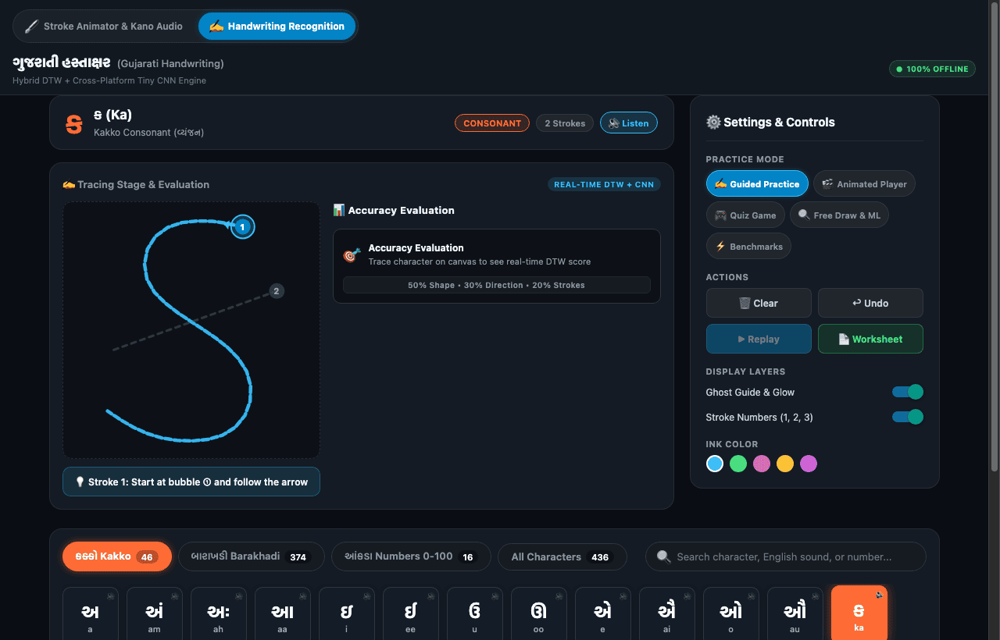
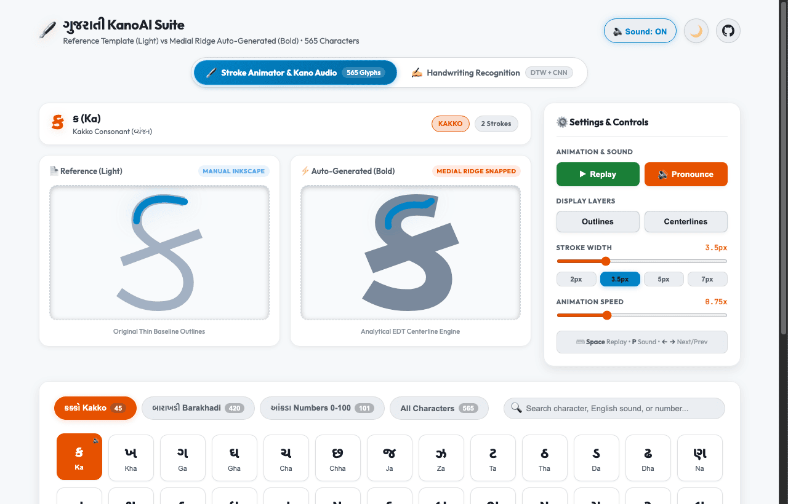

 
 [](http://www.instagram.com/gajjartejas)
[](http://www.twitter.com/gajjartejas)

# KanoAI (ગુજરાતી KanoAI Suite)

**The Comprehensive All-in-One Gujarati Language & AI Intelligence Suite.**

An open-source ecosystem bridging classical Gujarati typography, dynamic stroke animations, real-time handwriting recognition, native audio generation, Speech-to-Text (STT), Text-to-Speech (TTS), and AI grammar intelligence.

[](https://gajjartejas.github.io/KanoAI/)
[](https://gajjartejas.github.io/KanoAI/handwriting/)

🌐 **Live Interactive Apps**:
- **🖋️ Kano Stroke Animator & Audio**: [https://gajjartejas.github.io/KanoAI/](https://gajjartejas.github.io/KanoAI/)
- **✍️ Kano Handwriting Recognition & Practice Suite**: [https://gajjartejas.github.io/KanoAI/handwriting/](https://gajjartejas.github.io/KanoAI/handwriting/)

| 🖋️ Stroke Animator & Kano Audio Suite | ✍️ Handwriting Recognition & Practice Suite |
| :---: | :---: |
| [](https://gajjartejas.github.io/KanoAI/) | [](https://gajjartejas.github.io/KanoAI/handwriting/) |

---

## 🚀 The KanoAI Ecosystem Roadmap

| Module | Status | Description |
| :--- | :---: | :--- |
| **🖋️ Kano Trace** | ✅ **Live** | Stroke-by-stroke animation, EDT centerline extraction, and 565-character stroke catalog. |
| **✍️ Kano Handwriting** | ✅ **Live** | Real-time offline recognition combining Sakoe-Chiba DTW + in-memory Tiny CNN. |
| **🔊 Kano Audio** | ✅ **Live** | Compressed, crystal-clear native speech pronunciations for all 565 characters. |
| **🗣️ Kano Voice (TTS)** | 🚧 **In Progress** | Neural Text-to-Speech generation optimized for Gujarati phonetics and intonation. |
| **🎙️ Kano Listen (STT)** | 📋 **Planned** | Offline & low-latency Gujarati Speech-to-Text acoustic modeling. |
| **🧠 Kano Grammar (AI)** | 📋 **Planned** | LLM-assisted Gujarati spell-checker, grammar analysis, sandhi/samasa parser, and NLP toolkits. |
| **⚡ Kano API** | 📋 **Planned** | Lightweight REST / JSON microservices for characters, strokes, phonemes, and audio. |

---

## 📁 Repository Structure

```
KanoAI/
├── .agents/                      # Antigravity AI agent skills & custom workflows (/update-markdown)
├── handwriting/                  # Real-Time Gujarati Handwriting Recognition & Practice Workspace
│   ├── src/                      # Canvas, Guided Tracing, Quiz, Free Draw, Hybrid DTW + Tiny CNN
│   ├── __tests__/                # Automated test suites (30 tests)
│   ├── scripts/                  # Template extraction & model generation scripts
│   ├── package.json              # TypeScript, React Native Web, Expo, and Jest runners
│   └── README.md                 # Full technical spec & architecture documentation
├── node/                         # Node.js resource generation workspace
│   ├── package.json              # Dependencies (text-to-svg, node-fetch)
│   ├── index.js                  # Static SVG, CSV, and TTS audio generator
│   └── README.md                 # Node.js documentation and usage instructions
├── python/                       # Python workspace
│   ├── setup_venv.sh             # Industry-standard virtual environment setup script
│   ├── README.md                 # Python workspace overview & venv instructions
│   └── char_stroke_generation/   # Dedicated character stroke generation package
│       ├── stroke_generator/     # Core library (Bézier, EDT, HarfBuzz, IoU matching)
│       ├── scripts/              # Standalone CLI runners
│       ├── tests/                # Automated unit tests
│       ├── pyproject.toml        # PEP 621 packaging
│       ├── requirements.txt      # Pip dependencies
│       └── README.md             # Technical documentation & math formulations
├── docs/                         # Live GitHub Pages interactive frontend & Kano audio suite
│   ├── index.html                # Semantic responsive single-page web application
│   ├── css/                      # Modular styling (main, stage comparison, character grid)
│   ├── js/                       # Theme toggle, Kano audio player, stage renderer, app coordinator
│   ├── assets/                   # Full 565-character SVG catalog, compressed MP3 audio & previews
│   └── handwriting/              # Production web build for the Handwriting Recognition Suite
├── scripts/                      # Automated asset optimization & screenshot capture utilities
├── fonts/                        # Shared TrueType/OpenType Gujarati fonts
├── resources/                    # Shared JSON definitions & raw datasets (Kakko, Barakhadi, Numerals)
├── interpolate-svg/              # Manual reference SVG stroke templates
├── output/                       # Generated SVG artifacts & preview catalogs (.gitignored)
└── .github/workflows/            # GitHub Actions automated GitHub Pages deployment workflow
```

---

## 🌐 Live Interactive Frontend & Kano Audio Suite (`docs/`)

🔗 **Live Production Demo**: [https://gajjartejas.github.io/KanoAI/](https://gajjartejas.github.io/KanoAI/)

The live web application provides an interactive stroke animator and audio player:
- **All 565 Gujarati Characters**: Complete Kakko (45), full Barakhadi (420 across 35 consonants), and Numerals 0–100 (101).
- **Normalized 1:1 Stage Sizing**: Explicit `viewBox` coordinate normalization ensuring Reference (Light) and Auto-Generated (Bold) comparison cards scale with equal proportions and perfect centering.
- **Dedicated Settings Panel**: Right-side desktop dock with quick playback controls, layer toggles, speed adjustments, and keyboard shortcuts.
- **Dynamic Stroke Width Options**: Interactive slider (1px to 10px) with live preset pills (`2px`, `3.5px`, `5px`, `7px`) modifying both stages in real-time.
- **Kano Audio Pronunciations**: Speech pronunciations for all 565 characters, compressed via `ffmpeg` to high-efficiency MP3s, featuring auto-play on selection, dedicated `🔊 Pronounce` button, and persistent `Sound: ON/OFF` toggle.
- **Dark / Light Theme Toggle**: Top-right switch with Sun/Moon icons, custom HSL color palettes, and `localStorage` memory.
- **Mobile Responsive Design**: Clean side-by-side stages, compact slider grids, and touch-optimized character targets on mobile viewports.
- **Zero-Click GitHub Pages Deployment**: Fully automated via [`.github/workflows/deploy-pages.yml`](.github/workflows/deploy-pages.yml).

### 🖥️ Stroke Animator & Audio Previews

| Dark Theme (Default) | Light Theme |
| :---: | :---: |
| [](https://gajjartejas.github.io/KanoAI/) | [](https://gajjartejas.github.io/KanoAI/?theme=light) |

---

## ✍️ Real-Time Gujarati Handwriting Recognition & Practice Suite (`handwriting/`)

🔗 **Live Handwriting Web App**: [https://gajjartejas.github.io/KanoAI/handwriting/](https://gajjartejas.github.io/KanoAI/handwriting/)

A complete handwriting recognition and practice suite featuring:
- **Guided Practice**: Step-by-step Gujarati character tracing with directional hints, sequential stroke bubbles, and instant feedback.
- **Animated Player**: Interactive stroke-by-stroke playback of all 565 characters with speed controls and printable worksheet generator.
- **Quiz Game**: Gamified learning pairing Gujarati vocabulary, native audio pronunciation, and interactive drawing challenges.
- **Free Drawing & Recognition**: Multi-stroke canvas powered by a **Hybrid Recognition Engine** combining **Sakoe-Chiba Dynamic Time Warping (DTW)** and an in-memory **Tiny CNN (Conv2D/MaxPool/Dense)** classifier.
- **Accuracy Benchmarks**: Automated performance testing verifying sub-20ms latency and high recognition accuracy across characters.

### 🖥️ Handwriting Suite Preview

[](https://gajjartejas.github.io/KanoAI/handwriting/)

```bash
cd handwriting
npm install
npm test            # Run all 7 Jest test suites (30 tests)
npm run web         # Launch local development server
npm run build:web   # Export production bundle to docs/handwriting
```
👉 See [Handwriting Documentation (`handwriting/README.md`)](handwriting/README.md) for architecture details.

---

## 🟢 Node.js Workspace (`node/`)

Used for rendering standard glyph SVGs, CSV matrices, and Google Wavenet audio files.

```bash
cd node
npm install
node index.js
```
👉 See [Node.js Documentation (`node/README.md`)](node/README.md) for details.

---

## 🐍 Python Workspace: Character Stroke Generation (`python/`)

An analytical geometry and Euclidean Distance Transform (EDT) pipeline to automatically extract medial centerline strokes from Gujarati fonts for the **Kano** React Native educational app.

### Quick Start (Industry-Standard Virtual Environment Setup)

```bash
# 1. Run automated environment setup (creates .venv & installs dependencies)
./python/setup_venv.sh

# 2. Activate virtual environment
source .venv/bin/activate

# 3. Run automated unit tests
PYTHONPATH=python/char_stroke_generation python -m unittest discover -s python/char_stroke_generation/tests -t python/char_stroke_generation

# 4. Generate 56 showcase samples and launch interactive viewer
python python/char_stroke_generation/scripts/build_samples.py
python python/char_stroke_generation/scripts/build_viewer.py --serve 8765
```

👉 See [Python Workspace (`python/README.md`)](python/README.md) and [Stroke Generation Guide (`python/char_stroke_generation/README.md`)](python/char_stroke_generation/README.md) for details.

---

## 📚 Character Dataset & Catalog
 
The KanoAI suite catalogs and interactively supports **565 total characters**:
- **Kakko (45)**: Complete Gujarati vowels (સ્વર) and consonants (વ્યંજન).
- **Barakhadi (420)**: Comprehensive matra combinations across 35 consonants.
- **Numerals (101)**: Gujarati digits and numbers `૦` to `૧૦૦` (0–100) with complete transliterations and names.

Full structured JSON datasets and definitions are located in [`resources/`](resources/):
- [`resources/kakko.json`](resources/kakko.json)
- [`resources/barakhadi.json`](resources/barakhadi.json)
- [`resources/gujarati-numbers.json`](resources/gujarati-numbers.json)

All characters can be interactively browsed, animated, pronounced, and practiced in the [Live Suite](https://gajjartejas.github.io/KanoAI/).

---


## 🗺️ Roadmap & Upcoming Milestones

- [x] **Kano Trace**: 565-character stroke animation & analytical EDT centerline extraction.
- [x] **Kano Handwriting**: Dual DTW + Tiny CNN offline recognition engine (<20ms latency).
- [x] **Kano Audio**: High-efficiency compressed MP3 audio pronunciations for all characters.
- [ ] **Kano Voice (TTS)**: Neural Gujarati speech synthesis model for natural reading & pronunciation.
- [ ] **Kano Listen (STT)**: Offline Speech-to-Text engine optimized for regional accents.
- [ ] **Kano Grammar AI**: Contextual spell-checker, Sandhi/Samasa decomposition, and morphological analysis.
- [ ] **Kano Cloud API**: Developer REST/GraphQL endpoints for character stroke vectors, phonetics, and datasets.

## License

KanoAI is licensed under the [GNU GENERAL PUBLIC LICENSE](https://github.com/gajjartejas/KanoAI/blob/main/LICENSE).
