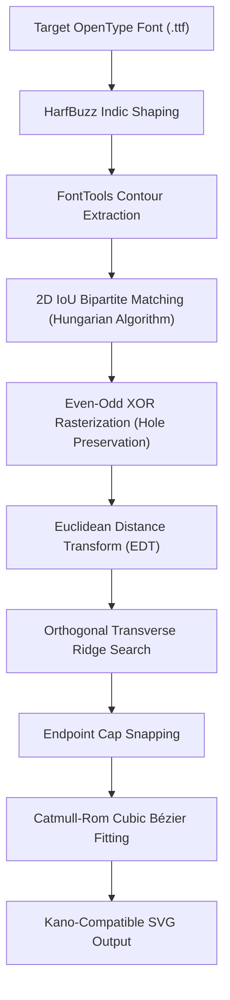

# Gujarati Font Stroke Generator (`stroke_generator`)

A high-precision mathematical pipeline and command-line utility to automatically extract medial centerline strokes from any OpenType/TrueType Gujarati font, deform reference animations to match bold/condensed font variants, and synthesize animated SVGs for interactive educational writing apps (such as the **Kano** React Native application).

---

## 🚀 Key Innovations & Mathematical Pipeline

Manual stroke tracing in Inkscape for Indic scripts typically takes weeks (521+ glyphs across Barakhadi and numerals). This package automates the entire process in seconds using an analytical geometry pipeline:



### 1. HarfBuzz OpenType Indic Shaping (`font/shaping.py`)
- Full Indic OpenType shaping (`uharfbuzz`) resolving pre-base vowel matras (e.g. `િ` in `કિ`), below-base conjuncts (`ક્ર`, `ક્ષ`), and conjunct ligatures (`જ્ઞ`).
- Exact typographic cursor advance accumulation in unscaled font UPEM units (`x_cursor += pos.x_advance`), eliminating duplicate scaling errors.

### 2. Bipartite 2D IoU Matching (`font/matching.py`)
- Automatically matches reference Inkscape template groups to shaped font glyphs by solving the **Hungarian algorithm** on the negative 2D Intersection-over-Union (IoU) matrix:
  $$\max \sum_{i, j} \text{IoU}(M_{\text{ref}, i}, M_{\text{target}, j})$$
- Correctly resolves visual reordering where reference group $g_0$ is the base consonant and $g_1$ is the pre-base vowel sign.

### 3. Even-Odd XOR Rasterization (`core/raster.py`)
- Evaluates closed subpaths with the **Even-Odd XOR rule**:
  $$M_{\text{glyph}}(x, y) = \bigoplus_{k=1}^K M_{\text{subpath}, k}(x, y)$$
- Preserves interior counter holes in digits and letters (e.g., `૦`, `૧`, `૪`, `ઠ`, `ઢ`) so the distance transform strictly evaluates to zero inside holes, preventing centerline strokes from crossing empty regions.

### 4. Transverse Normal Ridge Snapping (`core/ridge.py`)
- Standard Laplacian active contours (snakes) suffer from mean-curvature shrinkage, causing loops to collapse.
- This pipeline searches strictly along **orthogonal transverse unit normal vectors**:
  $$\vec{n}_i \perp \vec{t}_i, \quad \vec{p}_i^{(k+1)} = \vec{p}_i^{(k)} + s^* \cdot \vec{n}_i$$
  where $s^* = \arg\max_{s \in [-\Delta, +\Delta]} \text{EDT}(\vec{p}_i + s \cdot \vec{n}_i)$.
- Centerline points slide directly into the medial ridge without shortening or contracting along the stroke direction.

### 5. Endpoint Cap Snapping & Spline Fitting (`core/bezier.py`)
- Stroke endpoints search within the terminal cap for the local Euclidean Distance Transform peak, penalized by Euclidean distance to prevent jumps to adjacent strokes:
  $$\text{Score}(\vec{x}) = \text{EDT}(\vec{x}) - \lambda \|\vec{x} - \vec{p}_{\text{terminal}}\|$$
- Fitted using Catmull-Rom cubic Bézier curves with uniform chord arc-length parameterization and periodic boundary conditions for closed loops (`Z`).

---

## 📁 Package Directory Layout

```
python/char_stroke_generation/
├── pyproject.toml              # Modern Python packaging & build configuration
├── requirements.txt            # Package dependencies
├── README.md                   # Technical documentation and guides
├── stroke_generator/           # Core library package
│   ├── __init__.py             # Public API exports
│   ├── cli.py                  # Unified CLI tool (`stroke-gen`)
│   ├── pipeline.py             # Single glyph & parallel batch processing
│   ├── viewer.py               # Standalone interactive HTML compiler
│   ├── core/                   # Analytical geometry & numerical modules
│   │   ├── __init__.py
│   │   ├── bezier.py           # Catmull-Rom spline fitting & polyline resampling
│   │   ├── raster.py           # Even-Odd XOR rasterization & IoU masks
│   │   └── ridge.py            # Orthogonal transverse ridge relaxation
│   └── font/                   # Font shaping and glyph matching
│       ├── __init__.py
│       ├── shaping.py          # HarfBuzz Indic OpenType shaping
│       └── matching.py         # Hungarian bipartite 2D assignment
├── scripts/                    # Convenience entrypoint runners
│   ├── generate.py             # Single SVG generator
│   ├── build_samples.py        # 56-sample showcase generator
│   └── build_viewer.py         # Interactive viewer builder
└── tests/                      # Automated unit test suite
    ├── __init__.py
    ├── test_bezier.py          # Spline smoothness & periodic boundary tests
    ├── test_matching.py        # HarfBuzz shaping & Hungarian matching tests
    └── test_raster.py          # Even-Odd XOR hole preservation tests
```

---

## ⚙️ Installation & Environment Setup

In your Python virtual environment (Python 3.9+):

```bash
# Setup using the automated setup script
./python/setup_venv.sh

# Or install manually
source .venv/bin/activate
pip install -r python/char_stroke_generation/requirements.txt

# (Optional) Install package in editable mode with CLI command 'stroke-gen'
pip install -e python/char_stroke_generation/
```

---

## 🛠️ CLI & Script Usage

### 1. Generate Single Character SVG
```bash
python python/char_stroke_generation/scripts/generate.py \
  --ref interpolate-svg/svgs/barakhadi/1_k/0_k.svg \
  --char "ક" \
  --font fonts/Noto_Sans_Gujarati/NotoSansGujarati-Bold.ttf \
  --output output/ka_bold.svg
```

### 2. Batch Process All Glyphs
```bash
PYTHONPATH=python/char_stroke_generation python -m stroke_generator.cli batch \
  --category all \
  --font fonts/Noto_Sans_Gujarati/NotoSansGujarati-Bold.ttf \
  --output-dir output/generated_svgs \
  --workers 8
```

### 3. Build 56 Showcase Samples
```bash
python python/char_stroke_generation/scripts/build_samples.py
```

### 4. Build & Preview Interactive HTML Viewer
```bash
# Compile viewer.html and launch preview server on port 8765
python python/char_stroke_generation/scripts/build_viewer.py --serve 8765
```

---

## 🐍 Programmatic Python API

```python
import sys
from pathlib import Path
sys.path.insert(0, "python/char_stroke_generation")

from stroke_generator import (
    process_single_svg,
    run_batch,
    build_viewer_html,
    shape_text_with_harfbuzz,
    fit_cubic_bezier,
)

# Process a single character
success = process_single_svg(
    ref_svg_path="interpolate-svg/svgs/barakhadi/1_k/0_k.svg",
    font_path="fonts/Noto_Sans_Gujarati/NotoSansGujarati-Bold.ttf",
    text_string="ક",
    output_svg_path="output/ka.svg",
    target_font_scale=100.0,
)
```

---

## 🧪 Running Unit Tests

Execute the automated test suite with Python's built-in `unittest`:

```bash
PYTHONPATH=python/char_stroke_generation python -m unittest discover -s python/char_stroke_generation/tests -t python/char_stroke_generation
```

---

## 📱 Kano React Native App Compatibility

Every generated SVG adheres strictly to the Kano drawing engine specification:
```xml
<svg viewBox="0 0 100 100" xmlns="http://www.w3.org/2000/svg">
  <g id="g0" transform="translate(14.25, 18.30)">
    <!-- Outline mask (drawn first, used for clipping/fill verification) -->
    <path id="g0p0" d="M ... Z" fill="#000000" />
    <!-- Medial stroke (animated with stroke-dashoffset / animated SVG) -->
    <path id="g0s0" d="M ... C ... " fill="none" stroke="#ff4757" stroke-width="4" stroke-linecap="round" />
  </g>
</svg>
```
- `<g id="gX">`: Contains each independent grapheme cluster / glyph component with accurate positioning.
- `<path id="gXp0">`: Outlines the glyph for masking and tap/brush hit-testing.
- `<path id="gXs0">`: Medial centerline trajectory matching the direction and curvature of natural handwriting.
